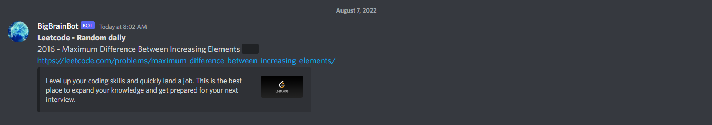

# PeruvianCheeseOil
A discord bot to drop daily coding problems on a specific channel.  
Uses Codechef daily, leetcode and codeforces randoms as sources.  
Simple points system per user, to keep track of progression.  

### References
[tutorial](https://www.freecodecamp.org/news/create-a-discord-bot-with-python/)  
[discord.py examples](https://github.com/Rapptz/discord.py/tree/master/examples)  
[replit host](https://replit.com)  
[uptimerobot for keep alive pings](https://uptimerobot.com)  

[codeforces api/problemset.problems](https://codeforces.com/apiHelp/methods#problemset.problems)  
[codeforces problem schema](https://codeforces.com/apiHelp/objects#Problem)  

[leetode (legacy implementation) problems list fishercoder1534/Leetcode](https://github.com/fishercoder1534/Leetcode)  
[leetcode metadata from Ruin9999/leetcode-api](https://github.com/Ruin9999/leetcode-api)
